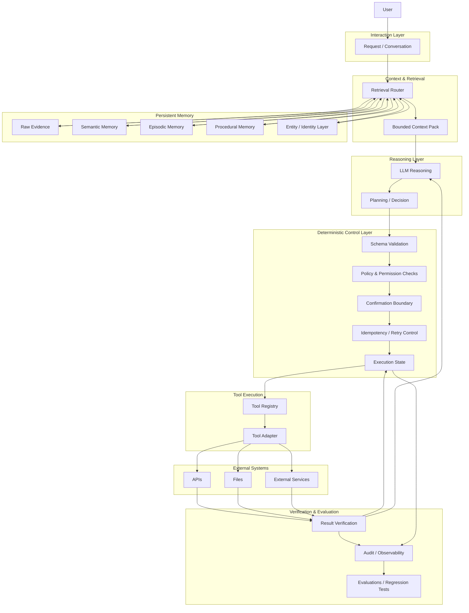
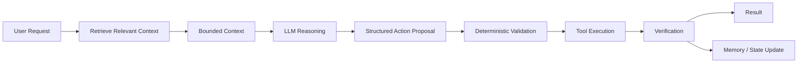

# Jarvis — System Architecture

> Status: Work in progress  
> This document represents the architectural direction of Jarvis. It intentionally distinguishes system responsibilities without implying that every component is already production-ready.

## Architecture Overview



---

## Core Architectural Idea

Jarvis is designed around a simple principle:

> **The LLM should reason about uncertain problems.  
> Software should enforce guarantees.**

The architecture therefore separates probabilistic reasoning from deterministic control.

The LLM can:

- interpret requests
- reason over context
- generate plans
- identify ambiguity
- propose actions
- generate explanations

Software should enforce:

- permissions
- schemas
- state integrity
- execution limits
- idempotency
- confirmation requirements
- retry policy
- irreversible action boundaries
- auditability

The model can propose.

The system decides what is actually allowed to happen.

---

## Simplified Data Flow



The most important architectural boundary is located between:

**what the model proposes**

and

**what the system actually executes.**

---

# Architectural Layers

## 1. Interaction Layer

The interaction layer receives the user's request.

Its role is not to assume that the current conversation contains all relevant information.

Instead, the request becomes the starting point for context construction.

```text
User
↓
Current Request
↓
Context Retrieval
```

Potential responsibilities include:

- receiving user input
- identifying explicit references
- preserving current conversational context
- providing the current request to downstream components

The interaction layer should remain relatively thin.

It should not become the canonical location for persistent state.

---

## 2. Context Retrieval

Jarvis should not place all available memory into every model request.

Instead, context retrieval attempts to determine which information is useful for the current task.

Potential signals include:

- semantic relevance
- entity match
- project scope
- recency
- memory type
- explicit user references
- current workflow state
- source provenance

The objective is to produce:

**minimum sufficient context**

rather than:

**maximum available context**

---

## 3. Bounded Context Pack

The result of retrieval is a bounded context pack.

Conceptually:

```text
Persistent Information
↓
Candidate Retrieval
↓
Filtering
↓
Ranking
↓
Conflict Handling
↓
Context Budget
↓
Bounded Context Pack
↓
LLM
```

A context pack may contain:

- current task
- relevant entities
- current project state
- important facts
- previous decisions
- active constraints
- supporting evidence
- provenance
- workflow state

It should not simply be a raw dump of search results.

---

## 4. Persistent Memory

Persistent memory is conceptually divided into several responsibilities.

### Raw Evidence

Information close to its original source.

Examples:

- conversations
- documents
- files
- observations
- imported information
- tool results

Raw evidence is useful because higher-level interpretations may later prove incorrect.

---

### Semantic Memory

Relatively stable knowledge.

Examples:

- facts
- preferences
- constraints
- relationships
- project information

Semantic memory answers:

**What is currently known?**

---

### Episodic Memory

Information about events and sequences over time.

Examples:

- previous interactions
- completed workflows
- project events
- investigations
- actions taken

Episodic memory answers:

**What happened?**

---

### Procedural Memory

Information about how tasks should be performed.

Examples:

- validated workflows
- standard operating procedures
- reusable investigation patterns
- tool sequences

Procedural memory answers:

**How should this type of task be performed?**

---

### Entity / Identity Layer

Information becomes more useful when the system knows what or whom it refers to.

Possible entities include:

- people
- organizations
- projects
- systems
- documents
- tasks
- concepts

This layer helps prevent the same real-world entity from becoming several unrelated memories.

---

## 5. Canonical State and Derived Projections

Jarvis distinguishes conceptually between:

**Canonical State**

and:

**Derived Projections**

Canonical state contains information whose integrity matters.

Derived projections can be recreated.

Examples of projections may include:

- vector indexes
- graph representations
- generated summaries
- Markdown views
- searchable indexes
- human-readable wiki views

Conceptually:

```text
Canonical Information
↓
Derived Projections
├── Vector
├── Graph
├── Wiki
├── Search Index
└── Other Views
```

This helps keep experimental infrastructure replaceable.

A retrieval technology should not automatically become the source of truth.

---

## 6. Retrieval Router

Different tasks may require different information sources.

The retrieval router is intended to determine which sources should be queried.

Example:

```text
Current Request
↓
Task / Intent Analysis
↓
Retrieval Router
├── Semantic Memory
├── Episodic Memory
├── Procedural Memory
├── Raw Evidence
├── Project State
└── Current Conversation
```

The router should avoid querying every source for every task.

---

## 7. Reasoning Layer

The reasoning layer receives the bounded context and determines what to do next.

This is where probabilistic behavior is useful.

The model may:

- interpret the request
- compare alternatives
- identify missing information
- reason over evidence
- construct a plan
- select an appropriate capability
- generate explanations

The reasoning layer should not own critical system guarantees.

---

## 8. Planning Layer

Planning and execution are separate responsibilities.

Jarvis should be able to generate a plan without automatically executing it.

Example:

```text
Goal
↓
Retrieve Information
↓
Generate Draft
↓
Validate Target
↓
Request Confirmation
↓
Execute
↓
Verify
```

The plan may be generated probabilistically.

Each execution step should still pass through deterministic controls.

---

## 9. Structured Action Proposal

When reasoning results in an external action, the model should produce a structured proposal.

Example:

```json
{
  "action": "send_message",
  "target_id": "team_42",
  "message_id": "draft_17"
}
```

The proposal is not yet an executed action.

It is a request to the execution system.

---

# Deterministic Control Layer

## 10. Schema Validation

Before execution, structured requests should be validated.

Possible checks include:

- required fields
- allowed types
- valid identifiers
- permitted values
- formatting
- field limits

Malformed requests should be rejected before reaching external systems.

---

## 11. Policy and Permission Checks

The model should not infer operational authority.

For example:

```text
Requested Action
↓
Actor Identity
↓
Required Capability
↓
Permission Check
↓
ALLOW / DENY
```

Permission state belongs to software.

Not to model confidence.

---

## 12. Confirmation Boundary

Some actions may require explicit user confirmation.

Potential classification:

```text
Read-only action
→ low friction

Reversible write
→ validated execution

External side effect
→ additional checks

Sensitive / irreversible action
→ explicit confirmation
```

The exact policy can evolve.

The principle remains:

**confidence is not authorization.**

---

## 13. Execution State

Operational state should exist outside the LLM.

Possible states include:

- proposed
- awaiting_confirmation
- authorized
- executing
- succeeded
- failed
- retryable
- cancelled
- rolled_back

The model can describe execution state.

Software should own it.

---

## 14. Idempotency

Retries can create duplicate real-world actions.

Example:

```text
Create Invoice
↓
Provider Creates Invoice
↓
Network Timeout
↓
Jarvis Thinks It Failed
↓
Retry
↓
Duplicate Invoice
```

A safer architecture uses a stable action identifier.

```text
Action Intent
↓
Stable Action ID
↓
Execution
↓
Recorded Result
```

If retried:

```text
Same Action ID
↓
Existing Result Found
↓
Do Not Execute Again
```

Idempotency is especially important for:

- messages
- payments
- resource creation
- external records
- workflow triggers

---

## 15. Retry Control

Retries should be controlled by software policy.

Possible deterministic limits include:

- maximum retries
- maximum tool calls
- maximum workflow steps
- execution timeout
- cost budget

The model should not be able to retry indefinitely.

---

# Tool Execution Layer

## 16. Tool Registry

Tools should be explicitly registered.

A tool definition may contain:

- name
- description
- input schema
- permission level
- side-effect classification
- retry behavior
- timeout
- validation rules
- audit requirements

This makes tools controlled capabilities rather than unrestricted functions.

---

## 17. Tool Risk Classification

Tools can conceptually be classified as:

### Read-only

Examples:

- search
- inspect
- fetch

### Reversible write

Examples:

- create draft
- update recoverable state

### External side effect

Examples:

- send message
- publish
- trigger workflow

### Sensitive or irreversible

Examples:

- delete data
- modify access
- perform financial action

Higher-impact tools require stronger controls.

---

## 18. Tool Adapter Layer

Jarvis should avoid coupling reasoning directly to provider-specific APIs.

Conceptually:

```text
Jarvis
↓
Internal Tool Contract
↓
Adapter
↓
External Provider
```

This allows the external provider to change without rewriting the reasoning architecture.

---

## 19. External Systems

Tool adapters may connect Jarvis to external systems such as:

- APIs
- file systems
- databases
- communication services
- productivity tools
- cloud platforms
- search systems

The architecture should treat these integrations as external dependencies.

Failures must therefore be expected.

---

# Verification and Observability

## 20. Result Verification

A successful provider response does not always mean the intended outcome happened correctly.

Important operations may require verification.

Example:

```text
Execute Action
↓
Provider Reports Success
↓
Verify Result
↓
Mark Completed
```

Possible verification patterns include:

- create resource → fetch resource
- update record → read updated value
- upload file → verify object exists
- external request → verify acknowledgement

---

## 21. Audit Trail

Important operations should generate a trace.

Useful information may include:

- action ID
- timestamp
- actor
- originating request
- selected tool
- tool parameters
- permission result
- confirmation state
- execution result
- retry count
- verification result
- errors

This should allow the system to answer:

**What happened?**

**Why did it happen?**

**What requested it?**

**Did it execute more than once?**

---

## 22. Observability

Jarvis should increasingly make system decisions observable.

Useful signals include:

- retrieved memories
- rejected retrieval candidates
- context size
- tool selected
- validation result
- permission decision
- execution state
- retries
- verification
- memory writes
- latency
- errors

Without observability:

> The AI behaved strangely.

With observability:

> Retrieval selected stale information because the freshness signal failed.

The second statement can be engineered.

---

# Memory and Tool Interaction

## 23. Tool Results Are Not Automatically Memory

A tool result may be:

- temporary
- incomplete
- stale
- task-specific
- incorrect

Therefore:

```text
Tool Result
↓
Current Context
```

does not automatically imply:

```text
Tool Result
↓
Persistent Memory
```

Persistent memory writes should pass through memory validation.

---

## 24. Memory Gate

Persistent memory should have a controlled write boundary.

Conceptually:

```text
Evidence
↓
Candidate Extraction
↓
Validation
↓
Classification
↓
Provenance
↓
Persistent Memory
```

This helps prevent:

```text
Hallucination
↓
Memory
↓
Future Retrieval
↓
Reinforced Hallucination
```

---

## 25. Correction Flow

Persistent information changes over time.

Conceptually:

```text
Existing Memory
↓
New Evidence
↓
Correction Detection
↓
Validate New State
↓
Supersede Old Value
↓
Preserve History
↓
Update Canonical State
```

The system should avoid simply accumulating contradictory values without structure.

---

# Evaluation Layer

## 26. Evaluations

Jarvis should evaluate behavior at several levels.

### Component

Examples:

- retrieval
- schema validation
- memory write
- permission check

### Integration

Examples:

- memory → retrieval → context
- reasoning → tool proposal → execution

### Workflow

Example:

```text
User Request
↓
Context
↓
Reasoning
↓
Execution
↓
Verification
↓
Response
```

### Regression

Verify that new architectural changes do not break previously validated behavior.

---

## 27. Evaluation Principle

The working rule is:

> **Evaluate behavior, not only answers.**

A good-looking response can still hide:

- incorrect retrieval
- stale memory
- unauthorized action
- duplicated execution
- missing verification
- broken state

Evaluation therefore needs visibility into the system.

---

## 28. Important Test Areas

Potential tests include:

### Memory

- fact storage
- correction
- provenance
- contradiction handling

### Retrieval

- recall
- precision
- freshness
- project isolation
- context budget

### Tool Execution

- invalid schema
- unauthorized action
- duplicate request
- retry exhaustion
- partial workflow failure

### Deterministic Boundaries

- confirmation enforcement
- permission enforcement
- state transition validation
- secret isolation

---

# Failure Handling

## 29. Partial Failure

Multi-step workflows can fail after some actions already succeeded.

Example:

```text
Step 1 — Success
↓
Step 2 — Success
↓
Step 3 — Failure
```

The architecture must determine:

- what already happened
- what should be retried
- what must not repeat
- whether rollback is possible
- whether user intervention is required

A workflow should not be treated as simply:

`success` or `failure`

when reality is partially complete.

---

## 30. Checkpoints

Long workflows may use checkpoints.

Conceptually:

```text
Step 1
↓
Checkpoint
↓
Step 2
↓
Checkpoint
↓
Failure
↓
Resume From Last Safe State
```

Checkpoints reduce the risk of repeating completed actions.

---

## 31. Compensation

Some actions can be reversed.

Example:

```text
Create Temporary Resource
↓
Later Step Fails
↓
Delete Temporary Resource
```

Other actions cannot be cleanly reversed.

Examples:

- sent email
- published message
- financial transfer
- external notification

Irreversible actions therefore require stronger pre-execution validation.

---

# Security Boundaries

## 32. Least Privilege

Tools should receive only the capabilities they require.

Example:

A document search capability may need:

`read`

but not:

`delete`

or:

`change_permissions`

Reducing permissions limits the impact of incorrect reasoning.

---

## 33. Secrets

Credentials should remain outside model context whenever possible.

Preferred architecture:

```text
LLM
↓
Structured Tool Request
↓
Secure Execution Layer
↓
Credential Injection
↓
External Provider
```

The model needs access to the capability.

It usually does not need access to the secret itself.

---

## 34. Project and Context Isolation

Persistent systems must prevent information from unrelated scopes from leaking into context.

Potential boundaries include:

- project
- user
- tool
- memory type
- information sensitivity

Retrieval should not assume that stored information is globally available.

---

# Architectural Contracts

## 35. Component Responsibilities

Jarvis increasingly treats components as contracts.

### Reasoning Layer

Promises:

- produce interpretations
- generate plans
- propose structured actions

Does not guarantee:

- authorization
- execution success
- persistent state integrity

---

### Retrieval Layer

Promises:

- retrieve relevant information
- respect scope
- respect context limits

Does not guarantee:

- truth of every stored memory

---

### Memory Layer

Promises:

- preserve accepted persistent information
- maintain provenance
- support correction

Does not automatically trust:

- every generated statement

---

### Execution Layer

Promises:

- validate structured actions
- enforce execution policies
- track operational state

Does not rely on:

- conversational memory as operational truth

---

### Evaluation Layer

Promises:

- test important properties
- expose regressions
- distinguish implementation from validation

Does not claim:

- perfect reliability

---

# Architectural Principles

## 36. Probabilistic vs. Deterministic Responsibilities

A simplified responsibility split is:

```text
LLM
→ interpretation
→ ambiguity resolution
→ semantic reasoning
→ planning
→ explanation
→ relevance estimation

Software
→ permissions
→ schemas
→ identity
→ state integrity
→ execution limits
→ retries
→ idempotency
→ irreversible action boundaries
→ audit history
```

The exact boundary continues to evolve.

---

## 37. Architecture Should Scale With Risk

Not every capability requires the same amount of infrastructure.

A useful heuristic is:

```text
Low consequence
→ model flexibility

Moderate consequence
→ structured validation

High consequence
→ deterministic policy

Irreversible consequence
→ policy + authorization + verification
```

Architecture should reflect actual risk.

---

## 38. Reliability Before Autonomy

Jarvis does not treat maximum autonomy as the primary objective.

A more useful progression is:

```text
Reliable Memory
↓
Reliable Retrieval
↓
Reliable Tools
↓
Reliable Execution
↓
Reliable Evaluation
↓
Greater Autonomy
```

Autonomy should increase only when the system demonstrates sufficient reliability.

---

## 39. Architecture Complexity Must Be Earned

The system should not add infrastructure only because the technology is interesting.

Each new component should answer:

- What problem does it solve?
- Is the problem demonstrated?
- Does another component already solve it?
- What new failure modes does it introduce?
- Can it be replaced?
- How will it be evaluated?

Complexity should provide measurable value.

---

# Development Flow

## 40. Development Philosophy

Jarvis is developed experimentally.

A typical cycle is:

```text
Problem
↓
Hypothesis
↓
Implementation
↓
Test
↓
Failure Analysis
↓
Architectural Decision
↓
Documentation
↓
Regression Test
```

Failures are useful evidence when they become reproducible.

---

## 41. Controlled Migration

Important architectural changes should not necessarily replace existing behavior immediately.

A possible migration path is:

```text
Implementation
↓
Backfill
↓
Shadow Mode
↓
Comparison
↓
Canary
↓
Production
```

Important migrations should support:

- observability
- rollback
- idempotency
- regression testing
- controlled exposure

---

## 42. Shadow Mode

A new component can run in parallel without becoming authoritative.

Example:

```text
Request
├── Current System → Production Result
└── New System → Comparison Only
```

This allows evidence to be collected before migration.

---

## 43. Validation Status

Public documentation should increasingly distinguish between:

- planned
- experimental
- implemented
- validated
- deprecated

This prevents architectural intention from being mistaken for production reality.

---

# Reusable Blueprint

## 44. Reusable Pattern

The architecture currently being explored can be summarized as:

```text
USER
↓
INTERACTION
↓
RETRIEVAL
↓
BOUNDED CONTEXT
↓
LLM REASONING
↓
STRUCTURED PROPOSAL
↓
DETERMINISTIC CONTROL
↓
TOOL EXECUTION
↓
VERIFICATION
↓
STATE + AUDIT
↓
EVALUATION
```

Persistent memory interacts with retrieval and state throughout the process.

---

## 45. Blueprint Requirements

A Jarvis pattern should not become part of a reusable blueprint simply because it exists in the project.

A reusable component should eventually document:

1. Problem
2. Context
3. Alternatives considered
4. Decision
5. Deterministic guarantees
6. Probabilistic responsibilities
7. Failure modes
8. Tests
9. Acceptance criteria
10. When to use
11. When not to use

The objective is to separate reusable architecture from accidental implementation history.

---

## 46. Architectural Summary

Jarvis can currently be understood as five major concerns:

### 1. Context

What does the model need to know now?

### 2. Memory

What information should persist over time?

### 3. Reasoning

What should the system conclude or propose?

### 4. Execution

What is the system actually allowed to do?

### 5. Evaluation

How do we know whether the architecture behaves correctly?

These concerns are related but should not collapse into one LLM prompt.

---

## 47. Current Status

Jarvis remains under active development.

This architecture document represents the current design direction and engineering principles.

It should not be interpreted as evidence that every component shown in the diagrams is already implemented or validated.

Some components are:

- implemented
- partially implemented
- experimental
- planned
- still under architectural review

As the private Jarvis implementation evolves, this public document should be updated to reflect validated reality rather than architectural aspiration.

---

## Final Principle

> **Jarvis is not designed as an LLM surrounded by features.**

> **It is being explored as a software system in which an LLM is one powerful probabilistic component operating inside explicit memory, execution, state, security and evaluation boundaries.**
